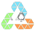

# 🌱 ReColeta - Plataforma de Gestão de Resíduos Sustentável

<div align="center">



**Uma plataforma moderna para conectar pessoas e promover o descarte consciente de resíduos**

[](https://nextjs.org/)
[](https://reactjs.org/)
[](https://www.typescriptlang.org/)
[](https://tailwindcss.com/)

</div>

## 🌍 Sobre o Projeto

ReColeta é uma plataforma web inovadora que facilita o descarte consciente de resíduos, conectando pessoas que precisam descartar materiais recicláveis com coletores e parceiros de reciclagem. Nossa missão é tornar a sustentabilidade mais acessível e eficiente.

### ✨ Principais Funcionalidades

- **🏠 Dashboard Interativo**: Painel com métricas de coletas, metas de sustentabilidade e estatísticas personalizadas
- **📋 Cadastro de Resíduos**: Sistema completo para registrar diferentes tipos de materiais (plástico, eletrônicos, papel, etc.)
- **🗺️ Coleta Geolocalizada**: Encontre resíduos disponíveis para coleta próximos à sua localização
- **📱 Interface Responsiva**: Design moderno e adaptativo para desktop e mobile
- **👥 Sistema de Usuários**: Autenticação segura com perfis de descartadores e coletores
- **📊 Relatórios Visuais**: Gráficos e estatísticas sobre impacto ambiental
- **🔍 Filtros Avançados**: Busque resíduos por tipo, localização, data e distância

## 🛠️ Tecnologias

### Frontend
- **Next.js 15** - Framework React com App Router
- **React 19** - Biblioteca para interfaces de usuário
- **TypeScript** - Linguagem com tipagem estática
- **Tailwind CSS** - Framework CSS utilitário
- **Shadcn/ui** - Componentes UI modernos e acessíveis

### Bibliotecas Principais
- **React Hook Form** - Gerenciamento de formulários
- **Zod** - Validação de esquemas
- **Recharts** - Visualização de dados
- **Lucide React** - Ícones SVG
- **Next Themes** - Suporte a temas claro/escuro
- **Sonner** - Notificações toast elegantes

## 🚀 Começando

### Pré-requisitos
- Node.js 18+ 
- pnpm (recomendado) ou npm

### Instalação

1. **Clone o repositório**
```bash
git clone https://github.com/Luizustavo/recoleta-web.git
cd recoleta-web
```

2. **Instale as dependências**
```bash
pnpm install
# ou
npm install
```

3. **Configure as variáveis de ambiente**
```bash
cp .env.example .env.local
```

4. **Execute o servidor de desenvolvimento**
```bash
pnpm dev
# ou
npm run dev
```

5. **Acesse a aplicação**
Abra [http://localhost:3000](http://localhost:3000) no seu navegador.

## 📁 Estrutura do Projeto

```
src/
├── app/                    # App Router do Next.js
│   ├── (private)/         # Rotas autenticadas
│   │   ├── dashboard/     # Painel principal
│   │   ├── discard/       # Cadastro de resíduos
│   │   ├── waste-collection/ # Coleta de resíduos
│   │   └── wastes/        # Gestão de resíduos
│   ├── (public)/          # Rotas públicas
│   └── api/               # API Routes
├── components/            # Componentes reutilizáveis
│   ├── features/          # Componentes específicos por feature
│   ├── forms/             # Formulários
│   ├── ui/                # Componentes base (Shadcn/ui)
│   └── charts/            # Componentes de visualização
├── context/               # Contextos React
├── hooks/                 # Hooks customizados
├── lib/                   # Utilitários e configurações
└── types/                 # Definições TypeScript
```

## 🔧 Scripts Disponíveis

```bash
# Desenvolvimento com Turbopack
pnpm dev

# Build de produção
pnpm build

# Iniciar servidor de produção
pnpm start

# Linting
pnpm lint
```

## 📊 Funcionalidades Detalhadas

### 1. Dashboard
- Métricas de coletas realizadas
- Progresso em relação às metas
- Gráficos de impacto ambiental
- Notificações e lembretes

### 2. Cadastro de Resíduos
- Formulário multi-etapas
- Upload de imagens
- Geolocalização automática
- Validação de dados com Zod

### 3. Sistema de Coleta
- Busca por proximidade
- Filtros avançados
- Solicitação de coleta com mensagens
- Acompanhamento de status

### 4. Gestão de Usuários
- Autenticação segura
- Perfis personalizados
- Histórico de atividades
- Sistema de reputação

## 🌐 API e Integrações

O projeto possui integração com APIs para:
- Autenticação de usuários
- Gestão de resíduos
- Geolocalização
- Upload de imagens
- Notificações

Consulte a pasta `docs/` para documentação detalhada das APIs.

## 🎨 Design System

O projeto utiliza um design system baseado em:
- **Shadcn/ui** para componentes base
- **Tailwind CSS** para estilização
- **Lucide React** para iconografia
- **Roboto** como fonte principal

## 📱 Responsividade

A aplicação é totalmente responsiva, funcionando perfeitamente em:
- 📱 Smartphones (320px+)
- 📱 Tablets (768px+)
- 💻 Laptops (1024px+)
- 🖥️ Desktops (1280px+)

## 🤝 Contribuindo

1. Faça um fork do projeto
2. Crie uma branch para sua feature (`git checkout -b feature/AmazingFeature`)
3. Commit suas mudanças (`git commit -m 'Add some AmazingFeature'`)
4. Push para a branch (`git push origin feature/AmazingFeature`)
5. Abra um Pull Request

## 📄 Licença

Este projeto está sob a licença MIT. Veja o arquivo `LICENSE` para mais detalhes.

## 👥 Equipe

- **Luiz Gustavo** - [@Luizustavo](https://github.com/Luizustavo)

## 📞 Contato

- **GitHub**: [https://github.com/Luizustavo/recoleta-web](https://github.com/Luizustavo/recoleta-web)

---

<div align="center">
  <p>Feito com ❤️ e ♻️ pensando em um futuro mais sustentável</p>
</div>
